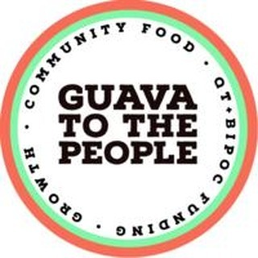

  

<h3 align="center"><b>Feeding the Revolution</b></h3>

  Guava to the People is a trans, queer, Cuban not-for-profit partnership that feeds and supports protestors, organizers, and folks who show up to support BLM/BIPOC/QTPOC movements.

  Built by <a href="https://www.linkedin.com/in/emily-zhai-b7b32a103/">Emily Zhai</a>

# Documentation
- [Getting Started](./docs/GettingStarted.md)
- [Sections](./docs/Sections.md)
- [Architecture](./docs/Architecture.md)
- [Tech Stack](./docs/Stack.md)
