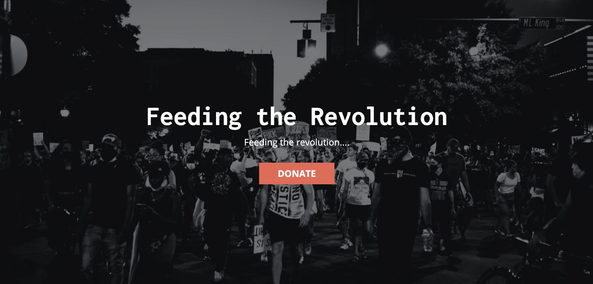
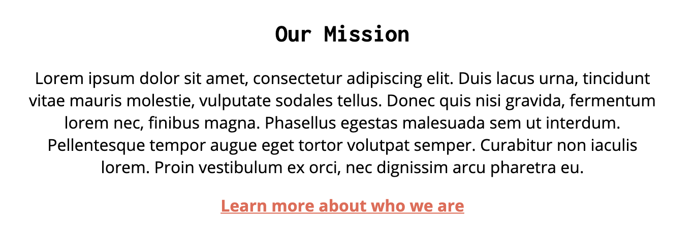
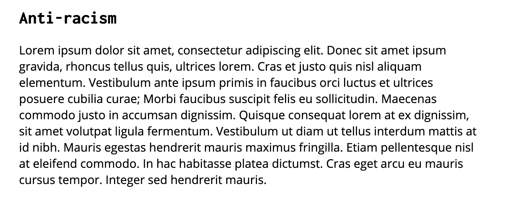
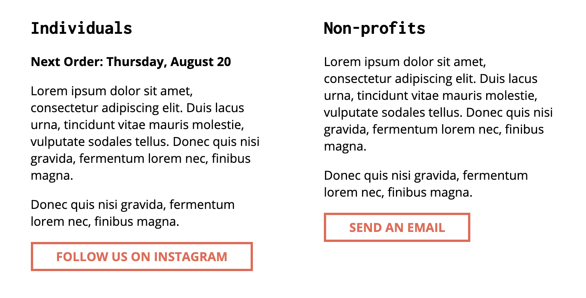
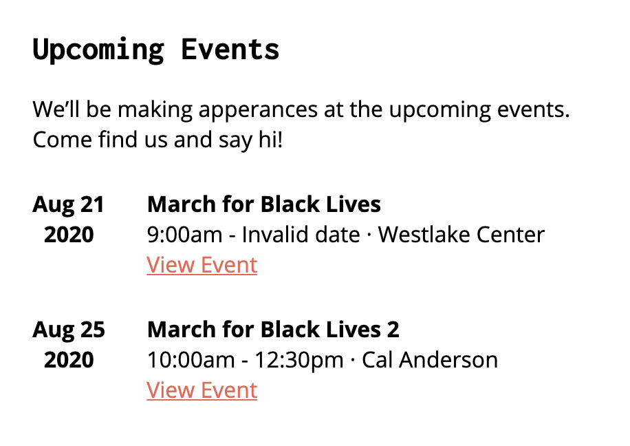
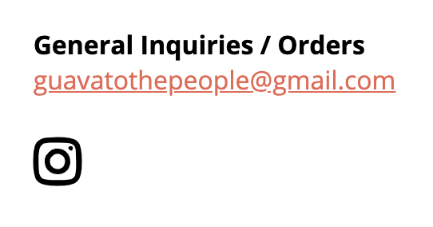
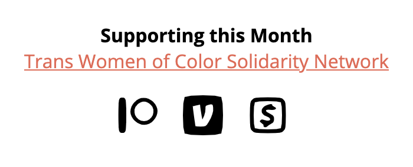
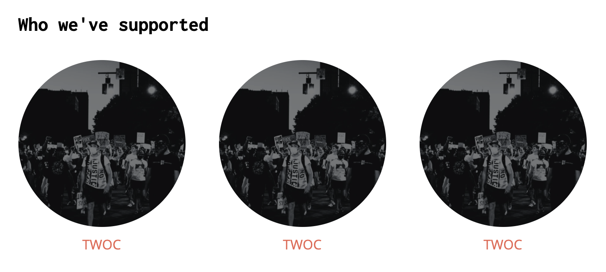

## Sections
**An important note on `actionLink`**
The `actionLink` property can be set to one of three types of URLs
- External URLs - To link to an external site, set `actionLink` to the *full URL* (ie. `https://www.google.com/`)
- Internal URLs - To link to an internal page on the site, set `actionLink` to the *relative URL* (ie. `/about`)
- Calendly shortcut - To link to a Calendly popup, set `actionLink` to the *Calendly URL* (ie. `https://calendly.com/guavatothepeople/pastelito-pick-up`)

Section components allow admins to render site content in a number of different formats.

Each section has an `id` and `__component` prop that identifies it. The `__component` prop is of type `ComponentType` which is structured as follows.
```
enum ComponentType {
  HERO_SECTION = 'sections.hero-section',
  SUMMARY_SECTION = 'sections.summary-section',
  TEXT_SECTION = 'sections.text-section',
  GRID_SECTION = 'sections.grid-section',
  EVENT_SECTION = 'sections.event-section',
  CONTACT_SECTION = 'sections.contact-section',
  DONATION_SECTION = 'sections.donation-section',
  CAROUSEL_SECTION = 'sections.carousel-section',
}
```

All other props are determined by section
- [Hero Section](###hero-section)
- [Summary Section](###summary-section)
- [Text Section](###text-section)
- [Row Section](###row-section)
- [Event Section](###event-section)
- [Contact Section](###contact-section)
- [Donation Section](###donation-section)
- [Carousel Section](###carousel-section)

### Hero Section
Displays a hero image that stretches across the full width of the site with text overlay and an optional CTA button.



```
{
  id: number;
  __component: ComponentType;
  title: string;
  subtitle?: string;
  actionLink?: string;
  actionText?: string;
  image: {
    url: string;
  };
}
```

### Summary Section
Short, rich text section with an optional CTA link.



```
{
  id: number;
  __component: ComponentType;
  title: string;
  text: string;
  actionLink?: string;
  actionText?: string;
}
```

### Text Section
Long, rich text section. Can optionally include a left or right aligned image.



```
{
  id: number;
  __component: ComponentType;
  title?: string;
  text: string;
  image?: {
    url: string;
  };
  alignImage?: ImageAlignment;
}

enum ImageAlignment {
  LEFT = 'left',
  RIGHT = 'right',
}
```

### Row Section
Displays up to three sets of text components in a single row. Each component can optionally contain a CTA button.



```
{
  id: number;
  __component: ComponentType;
  cells: {
    title: string;
    subtitle?: string;
    text: string;
    actionLink?: string;
    actionText?: string;
  }[];
}
```

### Event Section
Displays a list of events.



```
{
  id: number;
  __component: ComponentType;
  title?: string;
  subtitle?: string;
  events: {
    title: string;
    date: Date;
    startTime: Date;
    endTime?: Date;
    location?: string;
    eventLink?: string;
  }[];
}
```

### Contact Section
Displays a list of contact emails and a select set of social media links.



```
{
  id: number;
  __component: ComponentType;
  contacts: {
    title?: string;
    email: string; 
  }[];
  socials?: {
    icon: IconImage;
    link?: string;
  }[];
}

enum IconImage {
  INSTAGRAM = 'instagram',
  FACEBOOK = 'facebook',
  TWITTER = 'twitter',
  EMAIL = 'email',
  PATREON = 'patreon',
  VENMO = 'venmo',
  CASHAPP = 'cashapp',
}
```

### Donation Section
One of the more specialized sections. Displays the highlighted organization of the month and a select set of social icons.



```
{
  id: number;
  __component: ComponentType;
  organizationName: string;
  organizationLink?: string;
  socials: {
    icon: IconImage;
    link?: string;
  }[];
}

enum IconImage {
  INSTAGRAM = 'instagram',
  FACEBOOK = 'facebook',
  TWITTER = 'twitter',
  EMAIL = 'email',
  PATREON = 'patreon',
  VENMO = 'venmo',
  CASHAPP = 'cashapp',
}
```

### Carousel Section
Image carousel with optional captions and links on each image.



```
{
  id: number;
  __component: ComponentType;
  title: string;
  items: {
    image: Image;
    link?: string;
    caption?: string;
  }[];
}
```
